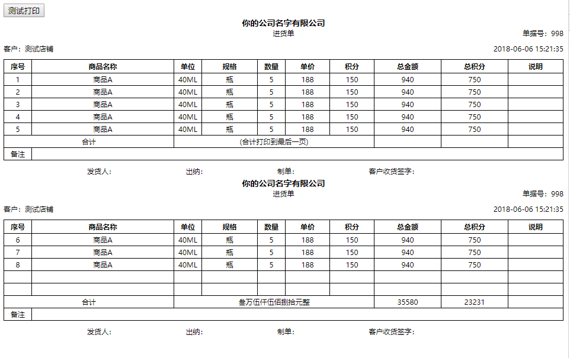

#vue-easy-print
>This is a vue 2.0 based print component
<p align="center">
   <a href="https://www.npmjs.com/package/vue-easy-print"></a>
   <a href="https://www.npmjs.com/package/vue-easy-print"></a>
 </p>

[中文文档](./README.MD)

[English](./README.EN.MD)

# core:
> Use the slot slot of the vue component to load the template.
>Copy the print area using iframe

# [demo](https://jsfiddle.net/pcloth/p35vz97u/)

## Update
V0.0.7 fixes compatibility issues. Thanks [Wizard67] (https://github.com/Wizard67)

## Quick start

### first step:
```sh
npm install vue-easy-print --save
```


###Step 2, in your vue page
```js
Import vueEasyPrint from "vue-easy-print";
Import the demo from './your path / demo';

export default {
    components: {
        vueEasyPrint,
        demo
    }
}
```

###Step 3, load the template:
``` html
<vue-easy-print tableShow>
    <template slot-scope="func">
        <demo :getChineseNumber="func.getChineseNumber"></demo>
    </template>
</vue-easy-print>

```

## slot-scope
The method received by func.getChineseNumber is to convert the amount into Chinese.


##Configuring props parameters
``` js
        // For paginated table mode: insert a blank line at the end
        spaceRow: {
            type:Boolean,
            default:false,
        },

        // For paging table mode: incoming print data.
        tableData:{
            type:Object,
            default() {
                return undefined
            }
        },
        // Whether to display the table
        tableShow:{
            type:Boolean,
            default:false
        },
        // How many lines per page
        onePageRow: {
            type:Number,
            default:5,
        },
        // Copy the hook that was called before printing the page
        beforeCopy:Function,
        // Hooks called before the page is printed
        beforePrint:Function,
```


## demo


``` html
<template>
    <div id="app">
        <button @click="printDemo">print</button>
        <vue-easy-print tableShow ref="easyPrint" >
            <!-- Write your own printed template -->
            <!-- <template slot-scope="func">
                <demo :getChineseNumber="func.getChineseNumber" ></demo>
            </template> -->
        </vue-easy-print>
    </div>
</template>

<script>
import vueEasyPrint from "vue-easy-print";
import demo from "./components/demo";
export default {
  name: "App",
  data() {
    return {
      tableData: {
        id: 998,
        store_name: "测试店铺",
        created_at: "2018-06-06 15:21:35",

        detail: [
          {
            name: "商品A",
            item_unit: "40ML",
            item_size: "瓶",
            item_quantity: 5,
            item_price: 188,
            pv: 150,
            item_total: 5 * 188,
            item_total_pv: 5 * 150
          },
          {
            name: "商品A",
            item_unit: "40ML",
            item_size: "瓶",
            item_quantity: 5,
            item_price: 188,
            pv: 150,
            item_total: 5 * 188,
            item_total_pv: 5 * 150
          },
          {
            name: "商品A",
            item_unit: "40ML",
            item_size: "瓶",
            item_quantity: 5,
            item_price: 188,
            pv: 150,
            item_total: 5 * 188,
            item_total_pv: 5 * 150
          },
          {
            name: "商品A",
            item_unit: "40ML",
            item_size: "瓶",
            item_quantity: 5,
            item_price: 188,
            pv: 150,
            item_total: 5 * 188,
            item_total_pv: 5 * 150
          },
          {
            name: "商品A",
            item_unit: "40ML",
            item_size: "瓶",
            item_quantity: 5,
            item_price: 188,
            pv: 150,
            item_total: 5 * 188,
            item_total_pv: 5 * 150
          },
          {
            name: "商品A",
            item_unit: "40ML",
            item_size: "瓶",
            item_quantity: 5,
            item_price: 188,
            pv: 150,
            item_total: 5 * 188,
            item_total_pv: 5 * 150
          },
          {
            name: "商品A",
            item_unit: "40ML",
            item_size: "瓶",
            item_quantity: 5,
            item_price: 188,
            pv: 150,
            item_total: 5 * 188,
            item_total_pv: 5 * 150
          },
          {
            name: "商品A",
            item_unit: "40ML",
            item_size: "瓶",
            item_quantity: 5,
            item_price: 188,
            pv: 150,
            item_total: 5 * 188,
            item_total_pv: 5 * 150
          }
        ]
      }
    };
  },
  methods:{
    printDemo(){
      this.$refs.easyPrint.print()
    }
  },
  components: {
    vueEasyPrint,
    demo
  }
};
</script>

```
## License

[MIT](https://github.com/pcloth/vue-easy-print/blob/master/LICENSE)