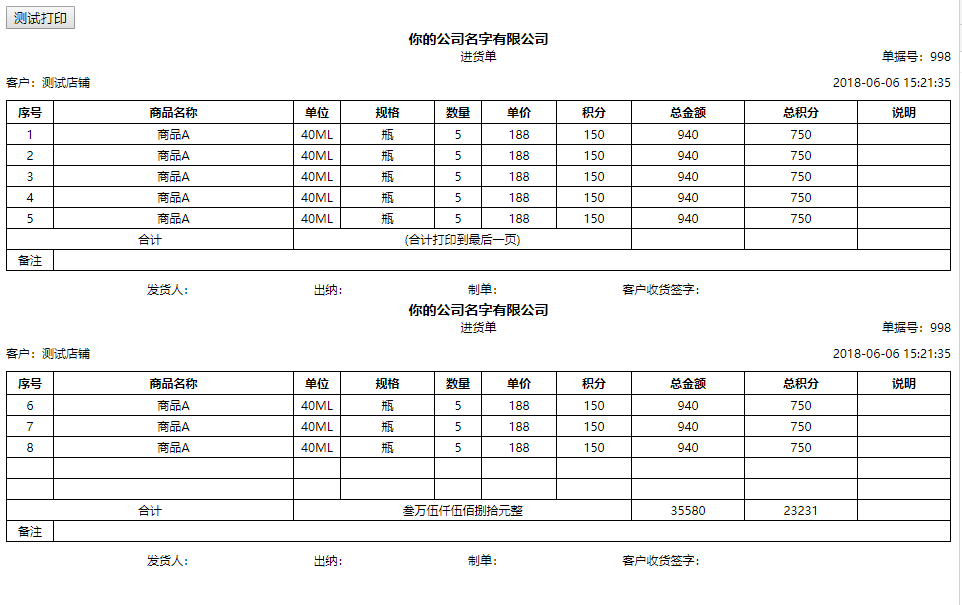

# vue-easy-print
> A print component that supports both Vue 2 and Vue 3.

<p align="center">
   <a href="https://www.npmjs.com/package/vue-easy-print"></a>
   <a href="https://www.npmjs.com/package/vue-easy-print"></a>
 </p>

[中文文档](./README.MD)

[English](./README.EN.MD)

# Core
> Render the print template through a Vue slot.
> Copy the print area into an iframe and trigger the browser print flow.

# [Online demo](https://jsfiddle.net/pcloth/p35vz97u/)

## Updates

#### 2026-03-13 ver 1.0.0
- adds support for both Vue 2 and Vue 3
- adds styleHTML props, thanks to [mrliuc](https://github.com/mrliuc)
- removed unused props; print styles are now fully managed by the template.

#### 2021 ver 0.0.7
- fixes compatibility issues, thanks to [Wizard67](https://github.com/Wizard67)

## Quick Start

### Step 1
```sh
npm install vue-easy-print --save
```

### Step 2: register the component in your Vue page
```js
import vueEasyPrint from "vue-easy-print";
import demo from "./your path/demo";

export default {
    components: {
        vueEasyPrint,
        demo
    }
};
```

### Step 3: provide the print template
```html
<vue-easy-print tableShow>
    <template slot-scope="func">
        <demo :getChineseNumber="func.getChineseNumber"></demo>
    </template>
</vue-easy-print>
```

## slot-scope
The default slot exposes the getChineseNumber helper, which converts a numeric amount into uppercase Chinese currency text.

## Props

| Prop | Type | Default | Description |
| --- | --- | --- | --- |
| tableShow | Boolean | false | Controls whether the print area is displayed. |
| buttonShow | Boolean | false | Controls whether the built-in print button is shown. |
| buttonClass | String | el-button el-button--default | Class name applied to the built-in print button. |
| beforeCopy | Function | - | Hook called before copying the print DOM, useful for preparing content. |
| beforePrint | Function | - | Hook called before triggering browser print, useful for regenerating QR codes or similar content. |
| styleHTML | String | - | No need to copy the project styles; just pass in a fixed style string. |

## Methods

| Method | Parameters | Returns | Description |
| --- | --- | --- | --- |
| init | - | void | Initializes the print iframe and syncs styles into the print context. It runs automatically after mount. |
| print | - | void | Starts the print flow. You can call it manually through a component ref, for example this.$refs.easyPrint.print(). |
| getStyle | - | void | Collects page-level style and link tags and injects them into the print iframe. Usually no manual call is needed. |
| getChineseNumber | currencyDigits | String | Converts a numeric amount into uppercase Chinese currency text for display in the template. |

## Full Demo


## Code
```html
<template>
    <div id="app">
        <button @click="printDemo">Test Print</button>
        <vue-easy-print tableShow ref="easyPrint">
            <!-- Write your own print template -->
            <!-- <template slot-scope="func">
                <demo :getChineseNumber="func.getChineseNumber"></demo>
            </template> -->
        </vue-easy-print>
    </div>
</template>

<script>
import vueEasyPrint from "vue-easy-print";
import demo from "./components/demo";

export default {
  name: "App",
  data() {
    return {
      tableData: {
        id: 998,
        store_name: "Test Store",
        created_at: "2018-06-06 15:21:35",

        detail: [
          {
            name: "Product A",
            item_unit: "40ML",
            item_size: "Bottle",
            item_quantity: 5,
            item_price: 188,
            pv: 150,
            item_total: 5 * 188,
            item_total_pv: 5 * 150
          },
          {
            name: "Product A",
            item_unit: "40ML",
            item_size: "Bottle",
            item_quantity: 5,
            item_price: 188,
            pv: 150,
            item_total: 5 * 188,
            item_total_pv: 5 * 150
          },
          {
            name: "Product A",
            item_unit: "40ML",
            item_size: "Bottle",
            item_quantity: 5,
            item_price: 188,
            pv: 150,
            item_total: 5 * 188,
            item_total_pv: 5 * 150
          },
          {
            name: "Product A",
            item_unit: "40ML",
            item_size: "Bottle",
            item_quantity: 5,
            item_price: 188,
            pv: 150,
            item_total: 5 * 188,
            item_total_pv: 5 * 150
          },
          {
            name: "Product A",
            item_unit: "40ML",
            item_size: "Bottle",
            item_quantity: 5,
            item_price: 188,
            pv: 150,
            item_total: 5 * 188,
            item_total_pv: 5 * 150
          },
          {
            name: "Product A",
            item_unit: "40ML",
            item_size: "Bottle",
            item_quantity: 5,
            item_price: 188,
            pv: 150,
            item_total: 5 * 188,
            item_total_pv: 5 * 150
          },
          {
            name: "Product A",
            item_unit: "40ML",
            item_size: "Bottle",
            item_quantity: 5,
            item_price: 188,
            pv: 150,
            item_total: 5 * 188,
            item_total_pv: 5 * 150
          },
          {
            name: "Product A",
            item_unit: "40ML",
            item_size: "Bottle",
            item_quantity: 5,
            item_price: 188,
            pv: 150,
            item_total: 5 * 188,
            item_total_pv: 5 * 150
          }
        ]
      }
    };
  },
  methods: {
    printDemo() {
      this.$refs.easyPrint.print();
    }
  },
  components: {
    vueEasyPrint,
    demo
  }
};
</script>
```

## License

[MIT](https://github.com/pcloth/vue-easy-print/blob/master/LICENSE)